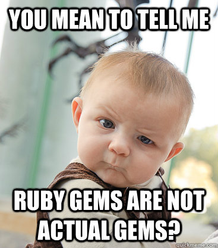

# Running your Ruby Scripts

You'll interact with your .rb files in a very similar way to your .js files.

You'll use the `ruby` command and the repl `pry` instead of using $`node` like you might do for JavaScript.

### REALLY IMPORTANT

Ruby *DOES NOT* run in the browser. It is *purely* a server side. You will only be able to load it into the terminal.

Remember that JavaScript runs server side as well as in the browser.


## Running ruby files

1. touch a file `test.rb`

2. add a line `puts "Hello from test.rb"`

3. run the file using ruby from the terminal $`ruby test.rb`

## Running ruby in the REPL

Ruby comes with a REPL called `irb` (Interactive Ruby Shell).  This is similar to us using the `node` command to write JS in the command line.  While `irb` is good for basic Ruby, there is another option called `pry` which is like `irb` with superpowers. We'll be using this throughout the course to debug.

## Gems

RubyGems is a package manager for Ruby that provides a standard format for distributing
Ruby libraries (in a self-contained format called a "gem"), a tool designed to easily
manage the installation of gems, and a server for distributing them. It was created in
2004.



Let's install some not so useful Gems.

```bash
gem install lolcat
gem install cowsay
```

## Installing Pry

1. To install `pry`, we will install a Ruby Gem. This is similar to the packages that you install using `npm`.

```bash
  gem install pry
  gem install pry-doc
```

2. To start pry, simply type `pry` in the command line. You should now see something like this.


3. You can now run any ruby code, similar to when we type JavaScript into `node`


## Loading files into Pry

You can also load Ruby files into the `pry` repl using the `load`

1. Add the following statement to `test.rb`

  ```ruby
  puts "hello from test.rb hello method"
  ```

2. Start pry $`pry` in the same directory as your Ruby file

3. In `pry` run `load 'test.rb'` it should print the message and return `true`. If it doesn't you likely did not specify the path correctly.

4. You should now have access to all the code in `test.rb`.

5. Add another statement to `test.rb`.

6. Run `load 'test.rb'` again to see the new results!

## Gaining Command Line superpowers in Ruby

Through `pry`, you have access to several commands that are commonly available in the command line.

Command line actions like `ls` and `cd` are available in `pry`. This will allow you to explore various classes. Since Ruby is an Object Oriented Language, this allows us to explore EVERYTHING.

Let's dive into the String class.

```
cd String
```

Your pry console should have changed from Main to String

Now lets see what is available for us to use in the String class.

```
ls
```

Using `ls`, we can see that there are plenty of methods available for us when using the String class. But what do these mean? Lets use the pry-docs to figure out what an `String.downcase` does.

```
? downcase
```

Now you should see some documentation on what the method does! This can be great in a pinch when you need to know what a method does.

## Lab (5 minutes)

Use `pry` to explore some of the built in objects in Ruby.  Here are some of the most common.

* String
* Array
* Integer
* Time
* Range
