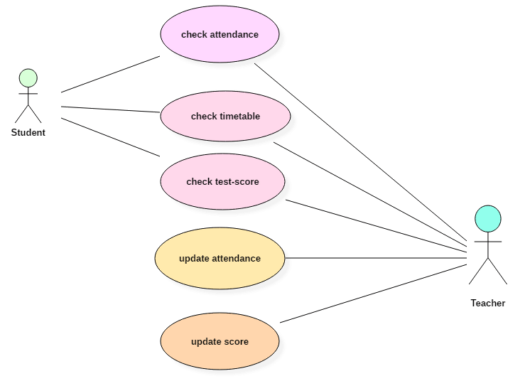

# Use Case Diagrams

## What is Use Case Diagrams

A use case diagram at its simplest is a representation of a user's interaction with the system that shows the relationship between the user and the different use cases in which the user is involved. A use case diagram can identify the different types of users of a system and the different use cases and will often be accompanied by other types of diagrams as well. The use cases are represented by either circles or ellipses

While a use case itself might drill into a lot of detail about every possibility, a use-case diagram can help provide a higher-level view of the system. It has been said before that **Use case diagrams are the blueprints for your system**. They provide the simplified and graphical representation of what the system must actually do.

### let's draw some examples for use case diagram

- [Use Case Diagram](https://creately.com/diagram-type/use-case)