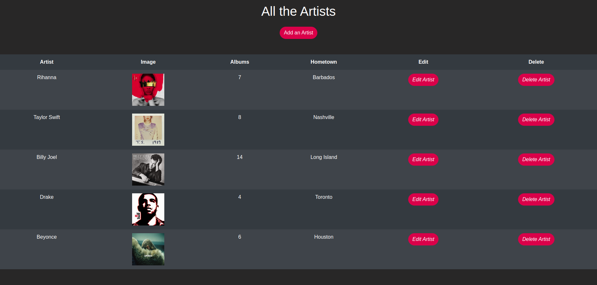

[](https://generalassemb.ly/education/software-engineering-immersive/)

# Asset Pipeline

[Launchschool Article](https://launchschool.com/blog/rails-asset-pipeline-best-practices)

- Allows for pre-processors such as Coffee, Sass, and ERb
- Minifies JS and CSS files
- Combines them all into one, so there are less requests to the server
- Browsers allow 10 parallel requests at any time, so if you have 15+ JS/CSS files, it can become a serious hindrance to load time

## How it works in a Nutshell

- Your Javascript files and CSS files all get compressed into 2 files: application.js and application.css. 
- Those compressed files get sent down to the public/assets directory and are served up for your viewing pleasure. 
- Your images and other files in app/assets get sent down the pipe to public/assets as well and are served from there.

## Three Features

- **Concatenation**
    - Rails uses Sprockets, a fancy term for puppetmaster, to take all your Javascript files and merge it into one single .js file. It does the same thing for CSS. This is brilliant because serving up less files means load times are that much faster.  
    - 15 Javascript or CSS files take longer than 1 Javascript or CSS file to load.

- **Compression**
    - Once those files have been merged together, they undergo a metamorphosis and are shrunk down to a more manageable size. Extra whitespace and comments are removed. 
    - When we code, our CSS files are formatted in a way to make things look pretty and visually appealing. But when you’re a machine, you don’t need comments or pretty indents and spaces. You’re a machine! And all this equates to faster loading times, since it’s less bits being transferred.

- **Precompilation** (of high-level languages)
    - Some of the best things about being a web developer right now is being able to use handy new next-gen higher-level languages. No longer do we have to survive by actually writing out every. single. HTML tag by hand. No longer do we have to write out lines and lines of code and make sure you get every bracket, comma, and semi-colon right. 
    - Now we have meta-languages like Coffeescript, Sass, ERB, HAML, and the list goes on! At this stage, our Rails Coffeescript and Sass files get converted – precompiled – to vanilla Javascript and CSS.

## Manifest Files
Rails needs to know which files to include in that giant blob, so it uses so-called “manifest” files to determine this. Your javascript manifest file will be in `app/assets/javascripts/application.js` It looks commented out, but the lines starting with //= tell Rails which files to go find and include. (P.S.The comments in the file are pretty useful). The `require_tree` helper method just grabs everything in the current directory.

## Sass and Coffeescript
I’ve mentioned Sass and Coffeescript a bit in the above sections, but I haven’t yet gone into what they are.

Sass and Coffeescript are languages that use preprocessors to transform their syntax into CSS and Javascript, respectively. They are included by default with Rails, and are probably the most popular to use.

## SCSS (Sassy CSS)
SCSS resembles standard CSS code closely. In fact, you can actually change the extension of a CSS file to `scss` and run it through a preprocessor and it will compile just fine. One big difference is, although you can write the same CSS code you are used to, you can also nest your rules.

so in css the following code is:

```css
.header .image {
    float: left;
    max-width: 80px;
}
```
while in scss (Sassy css) would be:

```css
.header {
  display: block;
  background-color: red;

  .image {
    float: left;
    max-width: 80px;
  }
}
```

## File Structure

It’s important to organize your assets in a way that is understandable to you, and facilitates the existing functionality of the asset pipeline. 
<br><br>The first thing you should know is that all of your custom Javascript, stylesheets, and images should go in the app/assets/ directory. By default, there is a folder each for javascripts, stylesheets, and images. <br><br>You can also add fonts, audios, and videos to the app/assets/ directory for those types of assets. All third-party code that you are using (e.g. jQuery, backbone.js, etc.) should be placed in the vendor/assets/ directory:


<br>

## Getting Started with Bootstrap4

### Installation

#### Step 1
We need to include a couple of gems in order to get started. In our `Gemfile` let's include:

```ruby
# Use Bootstrap4
gem 'bootstrap', '~> 4.3.1'
# Use jQuery
gem 'jquery-rails', '~> 4.3', '>= 4.3.3'
``` 

then run <span style="color:red">`bundle install`</span> in your terminal and **restart your server** to make the files available through the pipeline

#### Step 2

**Important:** Make sure the file has .scss extension (or .sass for Sass syntax). If you have just generated a new Rails app, it may come with a .css file instead. If this file exists, it will be served instead of Sass, so rename it.

Import Bootstrap styles in `app/assets/stylesheets/application.scss`

```scss
// Custom bootstrap variables must be set or imported *before* bootstrap.
@import "bootstrap";
```
The available variables can be found [here](https://github.com/twbs/bootstrap-rubygem/blob/master/assets/stylesheets/bootstrap/_variables.scss).

#### Step 3
Add Bootstrap dependencies and Bootstrap to your `app/assets/javascripts/application.js` file

```js
//= require jquery3
//= require popper
//= require bootstrap
```

<span style="color:red">**It is important that**</span>
```js
//= require_tree .
```
<span style="color:red">**is the last thing to be required**</span>


The reason is, `//= require_tree` compiles each of the other Javascript files in the javascripts directory and any subdirectories. 

If you require bootstrap after everything else, your other scripts may not have access to the Bootstrap functions.

<br>

## Congratulations!
That’s it! You now have a working Rails app with Bootstrap integrated.

<br>

# Code-along: Bootstrapify Muse App

### End Result:


