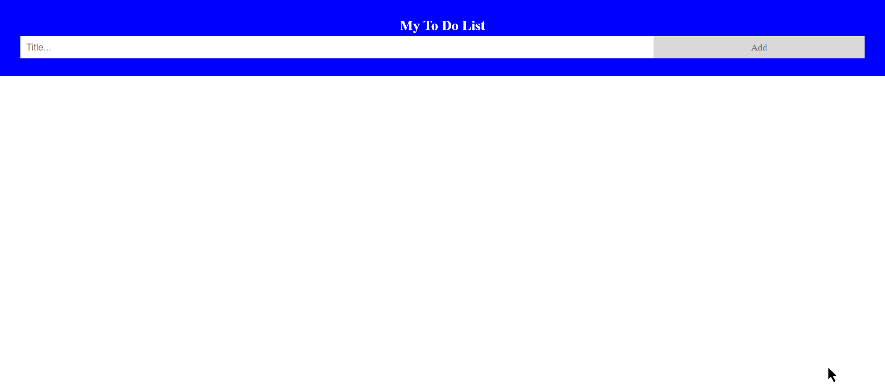

# Extra Lab: Todo List

## Todo List

Create a todo list from scratch using HTML + CSS + JS \(DOM\)

You should have:

* an input to insert the title for the new todo.
* a button to insert the new todo when you click on it.
* a list that has every to do, **HINT**: Array of what?
* in each todo-item have a title \(string\), an isCompleted \(boolean\).
* you can delete the todo when you click **X** button.
* you can check and uncheck the todo if you do it or not.
* improve the design of your todo list. 

