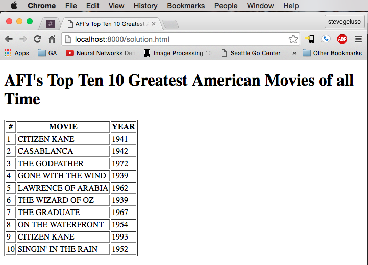

# Turning Text into Tables - Lab

This exercise involves converting a given skeleton text file into an HTML table. The text file contains a list of the top 10 movies of all time, according to the top of this list of [AFI's 100 GREATEST AMERICAN MOVIES OF ALL TIME](http://www.afi.com/100Years/movies.aspx)

## Getting Started

* Begin working in the `skeleton.html` file, which has a skeleton of the text needed for the page.

## Requirements

* The page title should be, **AFI's Top Ten 10 Greatest American Movies of all Time**
* The page should correctly use `table`, `thead`, `tbody`, `tr`, `th` and `td` tags.

## Solution Example

