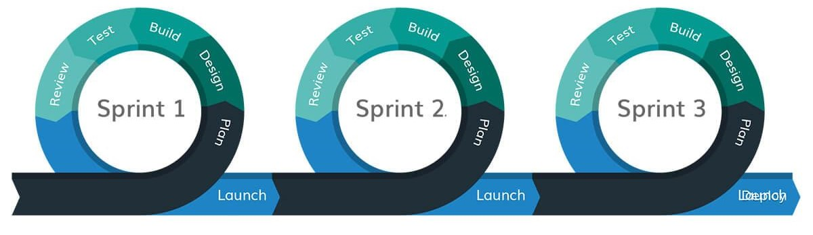
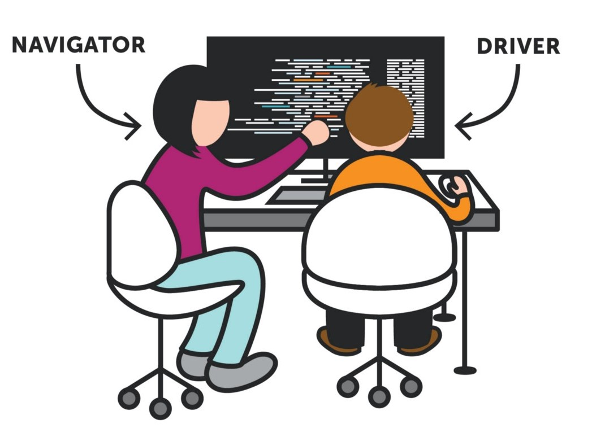
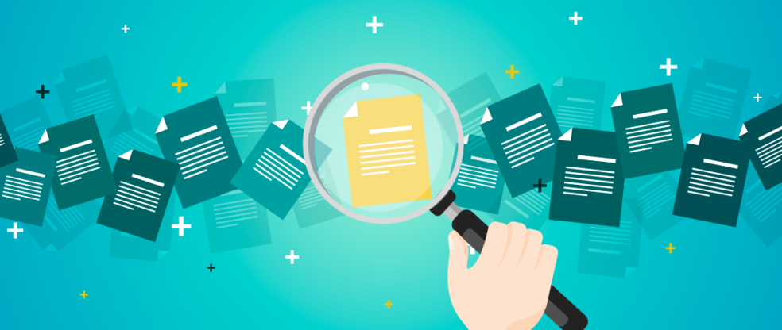
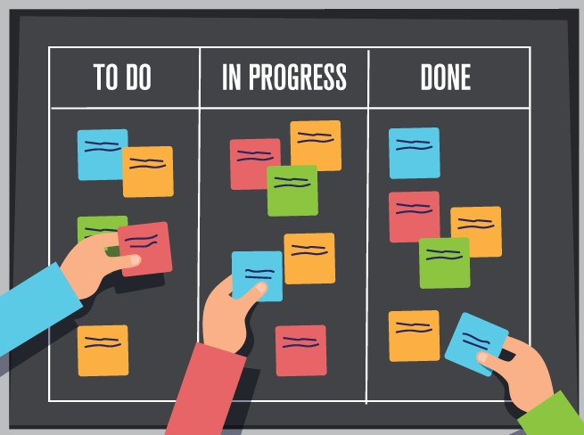
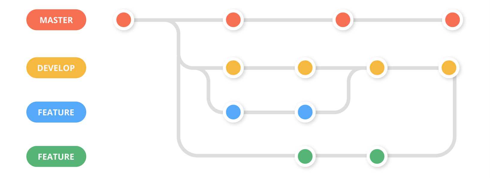

# W07D02 - Teamwork \(Research and Instruct\)

Each team is going to research a given topic and present it to their classmates. You will have 45 minutes to research, and 5 minute to present. Each team will choose a representative to explain their topic to the rest of the class. 

Each topic has key points to cover and useful links to explore. You are free to explore points and links outside what's given.

**Topics:**  
1- Agile Software Development  
2- Team Roles  
3- Pair Programming  
4- Software Documentation  
5- Kanban Boards  
6- Git Workflows  
7- Git Commit Messages

## 1- Agile Software Development

* **Key Points:**

  * What is Agile Development?
  * Manifesto
  * 12 Principles
  * Key Agile Concepts \(Briefly\)
  * Why Agile over other methodologies?

* **Resources:**
  * [Agile 101 - Agile Alliance](https://www.agilealliance.org/agile101/)
  * [What is Agile? -  Atlassian](https://www.atlassian.com/agile)
  * [What is Agile Development? -  Visual Paradigm](https://www.visual-paradigm.com/scrum/what-is-agile-software-development/)
  * [What is Agile Development? - Microsoft](https://docs.microsoft.com/en-us/azure/devops/learn/agile/what-is-agile-development)

##   2- Team Roles

* **Key Points:**

  * What are the types of software development roles?
  * Describe the responsibilities of each role.

* **Resources:**
  * [What are the different types of Software Engineer Roles? - Browser Stack](https://www.browserstack.com/guide/what-are-the-different-types-of-software-engineer-roles)
  * [Software development team structure – who brings what to the table? - The Software House](https://tsh.io/blog/software-development-team-structure/)
  * [Software Development Team Roles and Responsibilities You Should Know - Software Hut](https://softwarehut.com/blog/it-outsourcing/software-development-team-roles-and-responsibilities)
  *  [Stack Overflow Developer Survey 2020](https://insights.stackoverflow.com/survey/2020)

##  3- Pair Programming

* **Key Points:**

  * What is Pair Programming?
  * Styles and Techniques of Pair Programming
  * Benefits and challenges

* **Resources:**
  * [Pair Programming - Agile Alliance](https://www.agilealliance.org/glossary/pairing/)
  * [On Pair Programming - martinFowler](https://martinfowler.com/articles/on-pair-programming.html)
  * [Pair Programming Guide - Medium](https://medium.com/@weblab_tech/pair-programming-guide-a76ca43ff389)
  * [Pair Programming - MadeTech](https://www.madetech.com/blog/pair-programming)

##  4- Software Documentation

* **Key Points:**

  * What is Software Documentation?
  * Types of documentation
  * Why write documentation?
  * What is a README?
  * What are the key elements of a README?

* **Resources:**
  * [Building better documentation - Atlassian](https://www.atlassian.com/software/confluence/documentation)
  * [Software Documentation - Wikipedia](https://en.wikipedia.org/wiki/Software_documentation)
  * [How to write a good README for your GitHub project? - Bulldogjob](https://bulldogjob.com/news/449-how-to-write-a-good-readme-for-your-github-project)
  * [Art of README - Github](https://github.com/noffle/art-of-readme)
  * Useful documentation websites and tools: 
    * [GitBook](https://www.gitbook.com/)
    * [Confluence](https://www.atlassian.com/software/confluence)

##  5- Kanban Boards

* **Key Points:**

  * Definition of Kanban and Kanban Boards
  * Why use Kanban boards?
  * Kanban metrics
  * Useful Kanban apps and websites

* **Resources:**
  * [What is Kanban? - Atlassian](https://www.atlassian.com/agile/kanban)
  * [Kanban - Wikipedia](https://en.wikipedia.org/wiki/Kanban_%28development%29)
  * [Kanban Board - Agile Alliance](https://www.agilealliance.org/glossary/kanban-board/)

##  6- Git Workflows

* **Key Points:**

  * What is a Git Workflow?
  * Types of Git workflows
  * Benefits of each workflow

* **Resources:**

  * [What is a Git workflow? - GitLab](https://about.gitlab.com/topics/version-control/what-is-git-workflow/)
  * [Comparing Workflows - Atlassian](https://www.atlassian.com/git/tutorials/comparing-workflows)
  * [5 Git Workflows You Can Use to Deliver Better Code - Zepel](https://zepel.io/blog/5-git-workflows-to-improve-development/)

##   7- Git Commit Messages

* **Key Points:**

  * What is a Commit Message?
  * Why are commit messages important?
  * Types of commit messages
  * How to write commit messages?
  * How to write good commit messages?

* **Resources:**
  * [How to Write Good Commit Messages: A Practical Git Guide - Free Code Camp](https://www.freecodecamp.org/news/writing-good-commit-messages-a-practical-guide/)
  * [How to Write Good Commit Messages - Medium](https://medium.com/better-programming/how-to-write-good-commit-messages-and-why-is-it-important-18ac406ce33a)
  * [How to Write Useful Commit Messages - Dev.to](https://dev.to/jacobherrington/how-to-write-useful-commit-messages-my-commit-message-template-20n9)
  * [A Guide on Commit Messages - Dev.to](https://dev.to/yvonnickfrin/a-guide-on-commit-messages-d8n)

